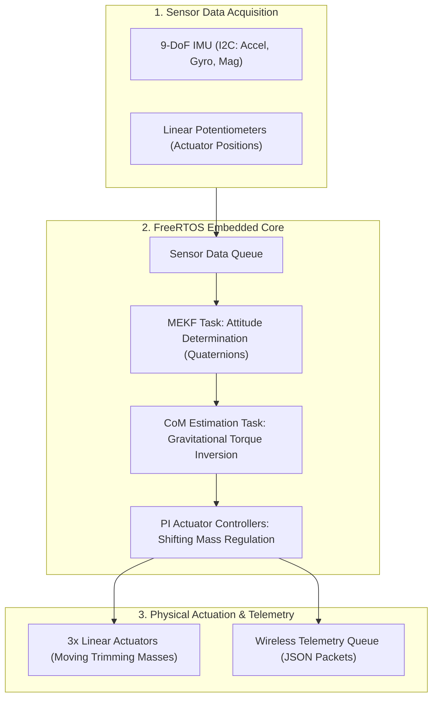

# 🛰️ 3-DoF Satellite Simulator: CoM Calibration & Attitude Control (MEKF)

<div align="center">

# 3-DoF Satellite Simulator • CoM Calibration & ADCS
### Master's Project • Electronic Systems (Control of Manipulators)
**Aalborg University (AAU) • Department of Electronic Systems**

[](https://github.com/elomarjc)
[](https://freertos.org)
[](https://github.com/elomarjc)
[](https://www.aau.dk)

</div>

---

## 🌌 Overview & Aerospace Challenge

Ground-based testing of satellite Attitude Determination and Control Systems (ADCS) requires emulating the frictionless, zero-gravity rotational dynamics of orbit. This is accomplished using **3-Degree-of-Freedom (3-DoF) spherical air-bearing simulators**.

However, any physical discrepancy between the satellite simulator's geometric center of rotation and its true **Center of Mass (CoM)** generates substantial gravitational disturbance torques:

$$
\boldsymbol{\tau}_g = \mathbf{r}_{\text{CoM}} \times m\mathbf{g}
$$

These parasitic torques disrupt orbital attitude control experiments and mask micro-Newton reaction wheel maneuvers.

This project implements an autonomous embedded system that dynamically estimates attitude via a **Multiplicative Extended Kalman Filter (MEKF)**, identifies the 3D Center of Mass offset vector $\mathbf{r}_{\text{CoM}}$, and actuates internal linear moving masses to align the center of mass with the spherical bearing pivot.

---

## 🧠 System Architecture & Estimation Algorithms



### 1. Multiplicative Extended Kalman Filter (MEKF)
* Represents attitude using unit quaternions $\mathbf{q}$ to prevent gimbal lock, with error state parameterization in 3D Gibbs/rotation vectors $\delta \boldsymbol{\theta}$.
* Fuses high-rate angular rates from gyroscopes with vector observations from accelerometers (gravity reference) and magnetometers (Earth magnetic field reference).
* Accurately tracks rotational states under dynamic air-bearing rotation.

### 2. Center-of-Mass Estimation & Dynamic Trimming
* Inverts the equations of motion to extract gravitational torque components from observed angular accelerations.
* Commands three orthogonal motor-driven lead-screw trimming masses to translate internal ballast until gravitational torque approaches zero (neutral buoyancy).

### 3. FreeRTOS Real-Time Concurrency
* Built with a deterministic task schedule operating across dedicated FreeRTOS queues:
  - `Queue_Measurements`: High-priority sensor ingestion at 50 Hz.
  - `Queue_MEKF`: State prediction and covariance update.
  - `Queue_Estimation`: Recursive parameter estimation.
  - `Queue_Communications`: Asynchronous wireless JSON logging to ground station PC.

---

## 📁 Repository Structure

```
satellite-simulator-adcs-calibration/
├── Final_code/
│   ├── Final_code.ino               # Master FreeRTOS task orchestrator & hardware init
│   └── Libraries/
│       ├── MEKF.h / .cpp           # Multiplicative Extended Kalman Filter implementation
│       ├── CoM_Estimation.h / .cpp # Gravitational torque inversion & CoM estimation
│       ├── Pot_Control.h / .cpp    # Actuator position feedback and discrete PI control
│       ├── Sensor.h / .cpp         # IMU I2C communication and raw sensor calibration
│       └── Communications.h        # Wireless JSON telemetry packet builder
├── inertia_matrix/                 # Inertia tensor modeling and theoretical calculations
├── Motors/                         # Motor driver characterization and calibration curves
├── Sensors/                        # Sensor noise variance benchmarking and Allan deviation
├── Simulation/                     # MATLAB / Simulink 3-DoF dynamics models
└── Tests/                          # Experimental static and dynamic bench test datasets
```

---

## 🎓 Academic Context

* **Course**: 7th Semester Master's Project • Control of Manipulators (CoM)
* **Degree**: M.Sc. in Electronic Systems
* **Institution**: Aalborg University, Denmark (AAU)
* **Discipline**: Space Robotics, Attitude Determination & Control Systems (ADCS), State Estimation (Kalman Filtering).
